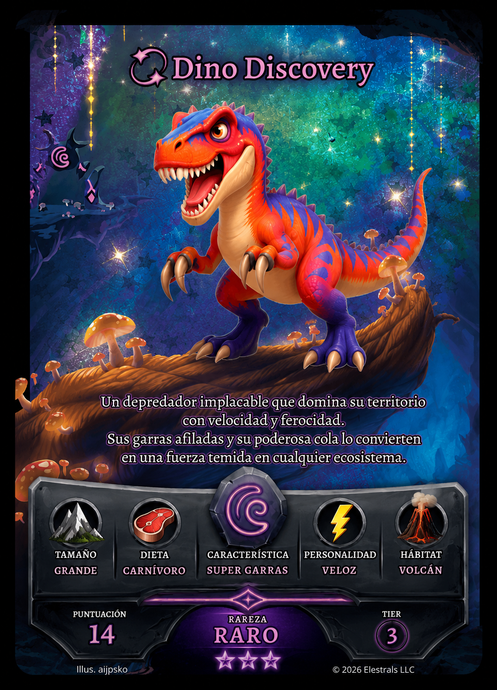
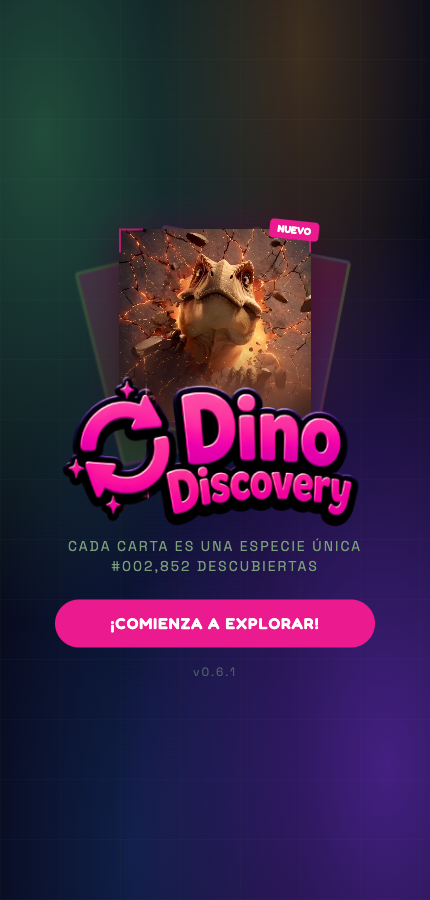
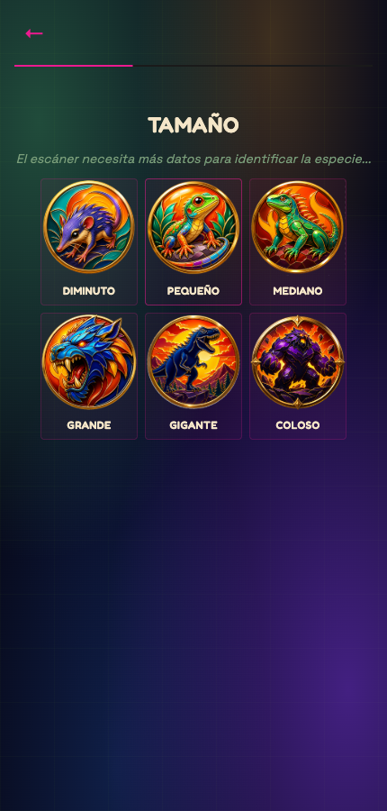
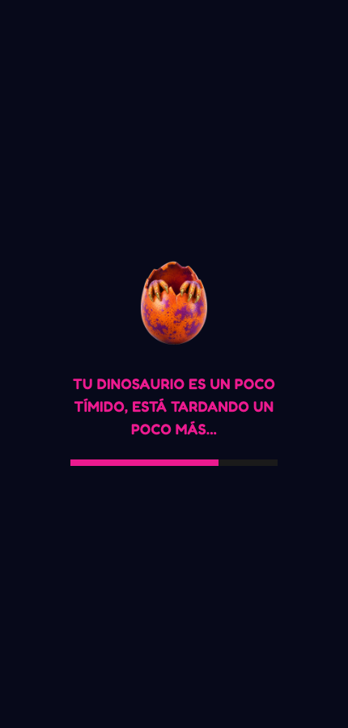
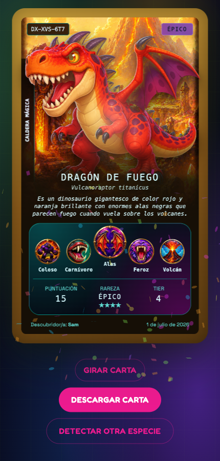

# Dino Discovery — Generador de cartas de dinosaurios con IA
### Proyecto de QA / ingeniería de producto | React · TypeScript · Cloudflare Workers · Claude · GPT Image

*Read this in [English](README.md).*

---

## Qué es este proyecto

Dino Discovery es una app web infantil donde un niño o niña crea su propio dinosaurio eligiendo cinco atributos (tamaño, hábitat, dieta, característica especial, personalidad) a través de un wizard corto, y recibe a cambio una criatura generada por IA —imagen, nombre científico, nombre común y una descripción de tres frases— reformulada como una **carta coleccionable de "descubrimiento de especie"**: un ID de especie determinista, un nivel de rareza calculado, arte de hábitat ilustrado detrás del dino, y una carta con giro/inclinación 3D que se puede arrastrar con el dedo o el ratón.

**En vivo:** [dino-discovery-generator.pages.dev](https://dino-discovery-generator.pages.dev)

Este README documenta el proyecto como un **caso de estudio de QA e ingeniería de producto**: no solo qué se construyó, sino los bugs reales encontrados, los enfoques equivocados que se probaron y se revirtieron, y el razonamiento detrás de cada decisión de diseño — el mismo rastro que dejaría para un compañero de equipo que retomase este código en frío.

---

## De dónde salió la idea

El punto de partida no fue "vamos a construir un generador de dinosaurios con IA" en abstracto — fue una carta de referencia cuyo layout me gustaba, y una pregunta: ¿podría un niño diseñar *esto*, con una IA rellenando el arte y el texto de sabor?



Esa referencia (una carta estilo TCG de fantasía, fondo oscuro, panel de atributos en piedra, pie con rareza/tier) es de donde salió el enfoque de "carta coleccionable, no solo una imagen generada". El lenguaje visual final acabó divergiendo bastante de esta referencia tras varios restyles (ver "Cómo lo construí" más abajo) — pero la idea estructural de *atributos → arte → rareza → objeto coleccionable* viene directamente de ahí.

---

## Para quién es

Niños y niñas (aproximadamente 5–10 años) a los que les gustan los dinosaurios y los juegos de cartas coleccionables, jugando solos o con un adulto leyendo las opciones en voz alta. El wizard es deliberadamente simple —elecciones de seis botones con imagen, sin necesidad de leer más allá del nombre del atributo, avance automático tras cada elección— y el resultado final (una carta compartible y descargable) está pensado para sentirse como *encontrar* algo en vez de *generar* algo, de ahí el enfoque de "descubrimiento de especie tipo ARG" (IDs de especie deterministas, niveles de rareza, crédito de "Descubridor/a") en vez de una pantalla de resultado tipo "aquí tienes tu imagen de IA".

---

## Herramientas y tecnologías

| Capa | Elección | Por qué |
|---|---|---|
| **Frontend** | React 19 + TypeScript (strict) + Vite | Ciclo de desarrollo rápido, el tipado estricto detecta desajustes de atributos/rareza en tiempo de compilación |
| **Estilos** | Tailwind CSS | Utility-first encajaba con el layout de la carta, muy literal en matemática de píxeles (ver "Card layout" en `CLAUDE.md`) |
| **Backend** | Cloudflare Pages Functions | Mismo despliegue que el frontend, sin un host de API separado que mantener |
| **Almacenamiento** | Cloudflare KV (caché, rate-limit, resultados) + R2 (imágenes generadas) | Serverless, pago por uso, sin base de datos que aprovisionar para un prototipo de bajo tráfico |
| **Generación de texto** | Anthropic Claude (`claude-haiku-4-5`) | Barato, rápido, salida JSON estricta fiable para nombre/descripción |
| **Generación de imagen** | OpenAI `gpt-image-2` | Elegido frente a `dall-e-3` (descontinuado) y `gpt-image-1` (se retira en oct. 2026); devuelve base64 directamente, sin URL temporal que expire |
| **Captura de email** | Kit (ConvertKit) API v4 | Captura de leads best-effort, explícitamente nunca bloquea la descarga (ver "Decisiones de diseño") |
| **Testing** | Vitest + Testing Library | Mismo stack para componentes de frontend y lógica de backend en Pages Functions |
| **Despliegue** | GitHub Actions → Cloudflare Pages | Auto-deploy en cada push a `main`, ~40s de build+deploy |

---

## Problemas técnicos resueltos

Una muestra de los problemas de ingeniería reales con los que se topó este proyecto — no una lista de features, sino una lista de "qué falló de verdad y cómo se arregló":

- **La carta descargada no coincidía con la carta en pantalla.** `html2canvas` (usado para rasterizar la carta en un PNG descargable) no captura de forma fiable un `transform: rotate()` de CSS sobre texto — tres técnicas de CSS distintas para la etiqueta rotada del hábitat se veían bien en vivo pero salían **en blanco** en el fichero capturado. Confirmado con muestreo de píxeles del output real, no solo con un vistazo visual. Solucionado pre-renderizando la etiqueta en un `<canvas>` y mostrándola como un `` normal, ya que `html2canvas` simplemente copia los bitmaps de imagen directamente.
- **Aparecía un artefacto blanco fuera de las esquinas redondeadas de la carta en la descarga.** `html2canvas` usa por defecto un fondo de canvas blanco opaco; las esquinas redondeadas de la carta son un recorte CSS `overflow-hidden`, no alfa real — así que el área fuera de ellas se rasterizaba en blanco sólido. Arreglado con `backgroundColor: null`.
- **Un reporte de "diferencia enorme de renderizado" resultó ser un artefacto del visor, no un bug real.** Tras un reporte de píldoras desalineadas y colores lavados en la descarga, reproduje el escenario exacto y luego muestreé los datos de píxel del PNG real directamente (no una captura de pantalla de una captura de pantalla) — opacidad completa, bordes limpios, sin patrón de tablero de ajedrez en el fichero en sí. El artefacto visual solo aparecía cuando *mis propias capturas de verificación* reescalaban la imagen, lo que apuntaba a que pasaba lo mismo en la miniatura de previsualización del móvil/escritorio del usuario. Reporté esto de vuelta con la evidencia en vez de descartar el reporte o "arreglar" a ciegas algo que no era un bug.
- **El vídeo de la landing parecía repetirse cada ~4 segundos** pese a no tener atributo `loop`. Causa raíz: un callback `ref` con función flecha inline obtenía una nueva identidad en cada render, y React desmonta y vuelve a montar un ref cada vez que su callback cambia de identidad — así que la llamada `.play()` del ref se disparaba de nuevo en cada re-render, y un contador en segundo plano que se actualizaba cada 4s estaba re-renderizando el componente con esa frecuencia. Llamar a `.play()` en un vídeo terminado lo reinicia desde 0 según la especificación HTML5. Arreglado memoizando el callback del ref.
- **Un panel con gradiente CSS pareció romperse en una pasada de debugging temprana**, pero una prueba de aislamiento controlada (cambiar el gradiente por un color plano y volver a comprobar) demostró que el panel nunca fue el problema — la regresión real estaba en otro sitio. Documentado en el repo para que una pasada futura no vuelva a investigar un callejón sin salida.
- **iOS Safari corrompía las caras frontal/trasera de la carta a mitad del giro** incluso con propiedades CSS 3D con prefijo de proveedor — un bug conocido de WebKit donde `backface-visibility: hidden` no oculta de forma fiable una cara dentro de un subárbol con transformación 3D y filtro. Arreglado con un fallback JS agnóstico de navegador (toggle de `visibility` sincronizado al punto medio de la rotación) por encima del CSS, ya que este fallo concreto no se reproduce en absoluto en Chromium/Playwright — solo verificable en un dispositivo real.

---

## Cómo lo construí

### Fase 1 — Flujo de generación principal

Wizard (cinco pasos de atributos + nombre) → `POST /api/generate-dino` → llamadas paralelas a Anthropic (texto) y OpenAI (imagen) → imagen guardada en R2 + texto cacheado en KV, indexado por un hash de los cinco atributos para que la misma combinación nunca se regenere. Rate-limit por IP (ventana fija en KV) para controlar el gasto de API, con una cabecera de bypass de administrador para testing.

### Fase 2 — De "imagen generada" a "carta coleccionable"

La pantalla de resultado se reformuló alrededor de la carta de referencia de arriba: un ID de especie determinista (hash de los atributos ordenados), un sistema de rareza por puntos (`docs/RARITY_SYSTEM.md`) con multiplicadores por combos especiales, arte de fondo ilustrado por hábitat (dos variantes de sub-bioma cada uno, elegidas de forma determinista para que las repeticiones se sientan intencionadas), y un panel de medallones de atributo en piedra.

### Fase 3 — La carta como objeto físico

Interacción 3D de giro/inclinación: arrastrar horizontalmente para rotar, arrastrar verticalmente para inclinar, encaje automático a la cara más cercana al soltar, un brillo holo-foil para cartas de rareza rara+ construido con tres capas CSS que se mueven de forma independiente (una sola capa reactiva se leía como "deslizándose", no "brillando" — esto costó tres iteraciones acertar, ver la sección "Rarity visual" de `CLAUDE.md` para los dos enfoques que rompieron el compositing 3D de iOS antes de llegar al actual).

### Fase 4 — Cuatro restyles visuales completos, elegidos en vivo

La identidad visual de la carta pasó por **cuatro direcciones de estilo comparadas en vivo** antes de publicarse: el look original de fantasía verde/púrpura, un look "espécimen de museo" crema/dorado, un look de cómic/pegatina, y el estilo actual "Terminal ARG" (cristal casi negro, brillo cian/magenta, tipografía monoespaciada) — construido vía una ruta de previsualización desechable solo-dev con un selector, comparados lado a lado, y luego borrados los tres perdedores. La misma técnica se reutilizó para decisiones más pequeñas: el color del borde del marco (comparación de 4 opciones), dos texturas de borde rechazadas, y la ubicación de la etiqueta de hábitat (comparación de 3 opciones entre una píldora rotada, una franja tipo lomo de libro, y una cinta de marcapáginas).

### Fase 5 — Hacer la descarga fiable

Aquí es donde salieron a la luz la mayoría de los bugs de "Problemas técnicos resueltos" de arriba — la brecha entre "se renderiza correctamente en el navegador" y "se renderiza correctamente en el PNG rasterizado por `html2canvas`" resultó ser la mayor fuente de bugs reales del proyecto, ninguno de ellos visible sin literalmente ejecutar la captura e inspeccionar los datos de píxel.

### Fase 6 — Pulido móvil y de dispositivo real

Escalado ajustado al contenedor para la carta (un wrapper `transform: scale()` dirigido por `ResizeObserver`, ya que el layout interno de la carta es matemática de píxeles de ancho fijo que no merece la pena hacer fluida), giro/inclinación por arrastre táctil, y un puñado de bugs solo-en-dispositivo-real (la corrupción del giro en iOS de arriba, un flash blanco en la landing por el rebote de overscroll, un "loop" de vídeo que en realidad era un bug de re-render) que Chromium/Playwright nunca reprodujeron y solo se pudieron confirmar en un móvil de verdad.

---

## Capturas de pantalla

| Landing | Wizard | Carga | Carta de resultado |
|---|---|---|---|
|  |  |  |  |

La carta de resultado de arriba ("Dragón de Fuego") es una generación real, no un mockup — Coloso / Volcán / Carnívoro / Alas / Feroz, rareza épica.

---

## Cómo lo he testeado

**136 tests automatizados** (Vitest + Testing Library), cubriendo componentes de frontend y Pages Functions de backend con fakes en memoria para KV/R2 — sin librería de mocks compartida, cada fichero de test construye sus propios helpers `createFakeKV`/`createEnv`. Backend y frontend comparten el mismo test runner y las mismas convenciones.

Lo que los tests automatizados *no* cubren, y cómo se gestionaron esos huecos:

- **El layout CSS de la carta no tiene tests de regresión visual.** Verificado manualmente vía capturas de Playwright en varios breakpoints (320–844px) durante el desarrollo, y vía testing en dispositivo real para bugs específicos de iOS que Chromium no puede reproducir (la corrupción del giro 3D, el loop del vídeo).
- **La ruta de descarga con `html2canvas` no tiene test automatizado de diff de píxeles.** Cada bug en esa ruta (ver "Problemas técnicos resueltos") se encontró escribiendo un harness de comparación puntual — renderizar el mismo componente de dos formas, ejecutar `html2canvas` de verdad, muestrear los datos de píxel del PNG resultante con `getImageData`, y comparar — para luego borrar el harness una vez el bug estaba arreglado y documentado. Fue una decisión deliberada: una suite permanente de diff de píxeles sería la respuesta "correcta" a largo plazo, pero no estaba justificada para un prototipo con un solo contribuidor y una ruta de renderizado poco tocada.
- **Cuando un reporte de bug resultó ser un falso positivo** (la "diferencia enorme de renderizado" que en realidad era un artefacto de miniatura del visor), se aplicó el mismo rigor a la inversa — no me quedé con el reporte al pie de la letra *ni* lo descarté, reproduje el escenario exacto e inspeccioné los bytes reales antes de concluir que no era un bug real.

---

## Decisiones de diseño

**Nunca bloquear la descarga por verificación de email.** Evaluado y rechazado explícitamente — el plan gratuito de Kit no tiene forma fiable de notificar a la app de una suscripción confirmada sin una pantalla de espera con polling, y la fracción de usuarios que abandonarían en vez de esperar no compensaba. El email se sigue capturando y enviando a Kit; simplemente nunca condiciona la descarga del certificado.

**La marca de agua en pantalla desincentiva las capturas de pantalla sin fingir bloquearlas.** Ninguna API web puede impedir la captura de pantalla nativa de un móvil. En su lugar, la carta *interactiva* muestra una marca de agua repetida; el nodo oculto que produce la descarga real (protegida por el gate de email) no la lleva. Una captura de pantalla de la carta en vivo lleva la marca de agua; la descarga real no — haciendo que la vía de descarga legítima sea el artefacto objetivamente mejor, en vez de intentar (y fallar en) bloquear la ilegítima. (Actualmente pausada en pantalla hasta confirmar que el renderizado de la descarga es pixel-perfect — ver `CLAUDE.md`.)

**Cachear por combinación de atributos, no por usuario.** Los mismos cinco atributos siempre resuelven al mismo texto + imagen cacheados (indexados por un hash de la combinación, versionado para poder invalidar la caché si cambia el prompt), pero cada envío sigue recibiendo su propio `resultId` y enlace compartible — así que dos niños distintos pueden "descubrir" la misma especie cada uno con su propio certificado, sin volver a pagar el coste de generación.

**Una única fuente de verdad para lógica de validación que existe en dos sitios.** Las listas de atributos del wizard (frontend) y la validación de peticiones del backend son necesariamente dos listas separadas (3.456 combinaciones posibles) — documentado explícitamente en `CLAUDE.md` como un punto de sincronización manual, en vez de fingir que existe una única fuente de verdad donde no la hay.

---

## Estructura del repositorio

```
Dino-discovery/
├── src/                        # Frontend React
│   ├── components/              # Landing, wizard, Card/CardScene (la carta ARG), pantalla de resultado
│   ├── data/                    # cardTheme (arte de hábitat, etiquetas de rareza), atributos
│   ├── utils/                   # speciesHash (rareza/ID), dinoCutout (chroma-key)
│   └── certificate.ts           # Captura con html2canvas + compartir/descargar
├── functions/                   # Cloudflare Pages Functions (backend)
│   ├── api/                     # generate-dino, results/:id, subscribe
│   └── lib/                     # anthropic, openai, r2, cache, rateLimit, kit
├── shared/types.ts               # Tipos compartidos entre frontend y backend
├── docs/
│   ├── RARITY_SYSTEM.md          # Tablas de puntos y umbrales de nivel de rareza
│   ├── future-features.md        # Ideas evaluadas, incluyendo las rechazadas deliberadamente
│   ├── screenshots/               # Imágenes usadas en este README
│   └── superpowers/               # Specs de diseño y planes de implementación por feature
├── scripts/                       # Generación puntual de assets con IA (medallones, dorso, logo)
└── CLAUDE.md                      # Memoria técnica: cada bug, decisión, y por qué
```

`CLAUDE.md` es el registro de ingeniería real de este proyecto — actualizado tras cada push a `main`, documenta no solo qué hace el código sino cada giro equivocado tomado para llegar ahí (enfoques de CSS fallidos, ajustes revertidos de la marca de agua, el callejón sin salida del gradiente del panel). Este README es el resumen; `CLAUDE.md` es el detalle.

---

## Historial de versiones

| Versión | Highlights |
|---|---|
| v0.1–v0.2.3 | Flujo principal de wizard + generación, persistencia de resultados vía `/r/:id`, reinicio/compartir/confeti, touch targets móviles |
| v0.3–v0.4 | Visual de rareza (holo-foil), giro/inclinación 3D por arrastre, fixes de compositing en iOS |
| v0.5 | Rediseño de la pantalla de inicio (vídeo, wordmark transparente, contador de descubrimientos en vivo), regeneración de iconos de medallón |
| v0.6 | Restyle completo de la carta ("Terminal ARG"), marco ámbar, etiqueta de hábitat rotada, marca de agua en pantalla |
| v0.6.1 | Arreglados los artefactos de etiqueta de hábitat y esquina blanca en el PNG descargado real |

Detalle completo por release: [GitHub Releases](https://github.com/melinDross/DinoDiscovery/releases).

---

## Ideas evaluadas y no implementadas

De `docs/future-features.md` — se mantienen aquí porque *decidir no construir algo* es tan decisión de producto como construirlo:

- **Verificación de email condicionando la descarga** — evaluado, rechazado explícitamente (ver "Decisiones de diseño").
- **Deduplicación de resultados entre sesiones** — no intentado; el enfoque de carta coleccionable implica que la misma especie siendo "descubierta" dos veces por niños distintos es una feature, no un bug.
- **Escenas contextuales por hábitat para todos los hábitats** — solo "Volcán" compone actualmente al dino en una escena apropiada a su hábitat; extenderlo a los seis hábitats necesita ingeniería de prompts, no cambios de arquitectura.
- **Vista de "Mi colección"** — la capa de datos ya existe (cada resultado persiste con un `resultId` compartible), la vista en sí nunca se construyó.
- **Exportar a PDF, analítica básica, tests E2E** — explícitamente fuera de alcance para este prototipo; el razonamiento de cada uno está en `docs/future-features.md`.

---

## Ejecutarlo en local

```bash
npm install
npm run dev        # Servidor de desarrollo de Vite (solo frontend, sin funciones de backend)
npm run build       # tsc --noEmit && vite build
npm run preview     # Previsualizar el build de producción en local
npm test            # vitest run — suite completa de 136 tests
npm run typecheck   # Solo tsc --noEmit
```

Para el stack completo en local (frontend + Cloudflare Pages Functions), copia `.dev.vars.example` a `.dev.vars`, rellena `ANTHROPIC_API_KEY`/`OPENAI_API_KEY`, y luego:
- `npx wrangler pages dev dist --compatibility-date=2026-06-28 --compatibility-flags=nodejs_compat` (tras `npm run build`), o
- `npx wrangler pages dev -- npm run dev` para recarga en caliente del frontend con las funciones corriendo.

### Desplegar tu propia copia

1. `npx wrangler kv namespace create RATE_LIMIT_KV` / `CACHE_KV` / `RESULTS_KV`, copiar los IDs a `wrangler.jsonc`
2. `npx wrangler r2 bucket create dino-discovery-images`
3. `npx wrangler pages project create dino-discovery-generator --production-branch main`
4. `npx wrangler pages secret put ANTHROPIC_API_KEY / OPENAI_API_KEY / KIT_API_KEY / KIT_FORM_ID / ADMIN_KEY --project-name dino-discovery-generator`
5. `npm run build && npx wrangler pages deploy dist --project-name dino-discovery-generator`

---

## Repositorio

[github.com/melinDross/DinoDiscovery](https://github.com/melinDross/DinoDiscovery)
